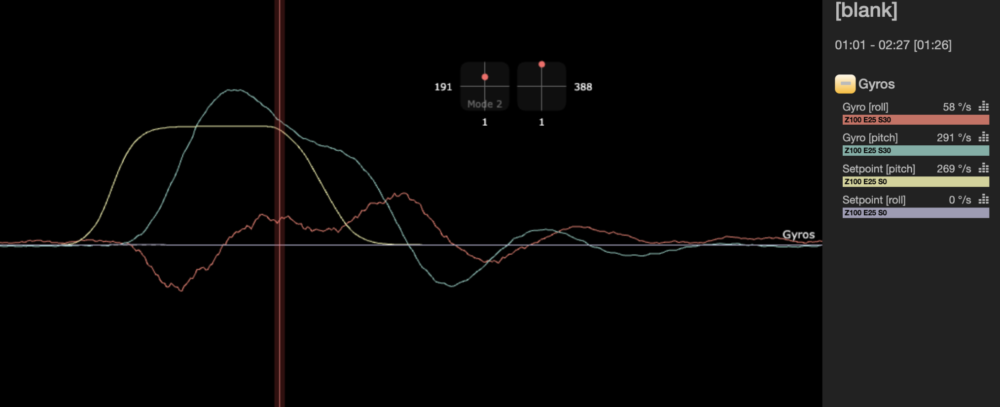
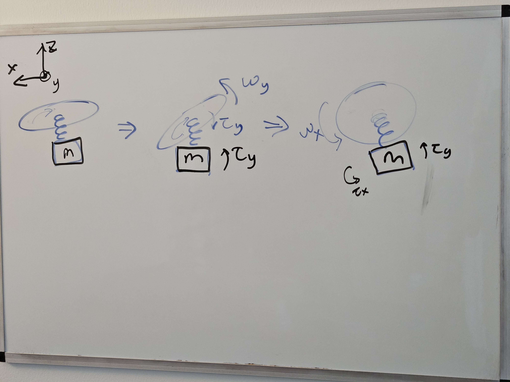

# Modeling Cross Coupling
By Etocii

An Initial Attempt in Theorizing Cross-Coupling Oscillation Between Roll and Pitch Axis on Miniature Radio Controlled Helicopters

# How to model the Cross Coupling

## The problem
When the helicopter experience high disturbance in the pitch axis, it would wobble to the roll axis. Similarly, when the helicopter experience disturbance in the roll axis, it would transfer to the pitch axis, but to a lesser degree.

  
(Thanks to Jonas for the picture)

## To explain the coupling

### Theory 1
It might be due to the fact that the rotor and motors are spinning disks. Due to gyroscopic precession, there must be some coupling between pitch and roll axis. (Not true, perfect spinning disks does not have coupling)
Instead, if theory 3 dominates, conventional motor would provide the same motion. However, direct drive motor would actually counter the tilting motion.

### Theory 2
The transient coupling is likely due to the change of phase lag of the main rotor during sudden change of roll/pitch rate. At high acceleration, the blades flex and introduce a much smaller phase lag (<90 degrees). 

### Theory 3
The rotor and body can be modeled as a rigid spinning disk and a body coupled by a spring and a damper. When commanded to pitch forward, the disk tilts forward first and the body stays the same attitude. Since there is a difference in angles, the spring loads up, giving the body a torque in positive pitch. However, by Newton's third law, the disk would "feel" a positive pitch force, which turns 90 degree and gives a torque on the roll axis. 

## To explain the different magnitudes

### Theory 1
There is a large difference in inertia between pitch and roll axis.

### Theory 2
Tennis Racket theorem. The pitch axis is the second principal axis which is unstable.

## Proposed controller design

### Theory 3
If theory 3 is the main contributor of the coupling effect, one simple idea is to make the disk rolling forward at all time. To know that the disk has a force on it, we need to take derivative of the gyro signal (i.e. D-term) and add that to the roll axis. There is no need for this on the Roll-to-pitch since there is not much coupling. 