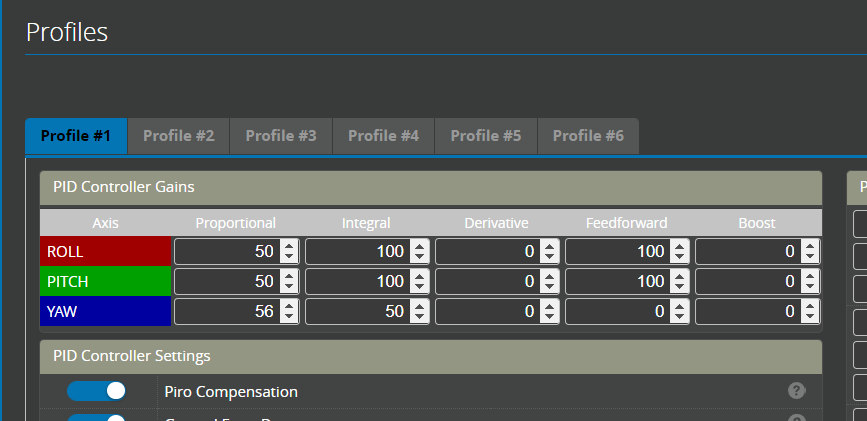
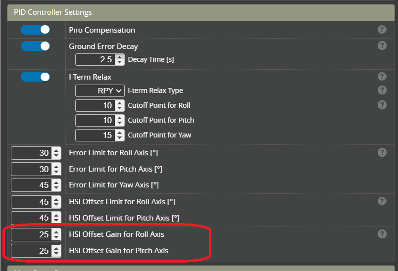

# Tuning your Helicopter

The default tuning parameters supplied with Rotorflight are designed to be safe and flyable for all helicoptes. This means in most cases the helicopter will not be responsive and locked in on your first flight and some tuning will be required. 

These tuning parameters are located on the Profile tab in the [Configurator](../Tutorial-Setup/Profiles.md) and could also be changed via the [LUA Scripts](../Tutorial-Setup/LUA-Scripts.md) or [Adjustments](../Tutorial-Walkthroughs/Tuning-using-Adjustments.md) or Adjustments

## Tuning Profile PID:  

:::caution
Please start by confirming your filters are working correctly before you increase your tuning parameters. If you do not have filters enabled it is particularly important that you do not use Derivative. This can result in hot Motors and Servos. 
:::

1. Increase Derivative (D) on each axis individually, (roll, pitch, yaw) until it wobbles, then back off a bit. **(remember!! don't do this of your filters are not working)**.  

2. Increase Proportional (P) on each axis individually, until it wobbles, then back off a bit.
3. Increase Integral (I) on each axis individually, until it wobbles, then back off a bit.
 
4. Set Feedforward so that you get good response and I remains near 0 in full stick flips and rolls (viewed using the blackbox logs). Feedforward can also be tuned by following the desctiption in [Tune Feedforward](Tune-Feedforward.md). 
 
5. If necessary, then tweak P:D ratio to tweak stick response damping to your liking.

6. Increase [HSI](./High-Speed-Integral.md) until it wobbles when jabbing elevator at full collective, back off a bit. 

7. Increase Boost (B) if you want sharper/faster response.