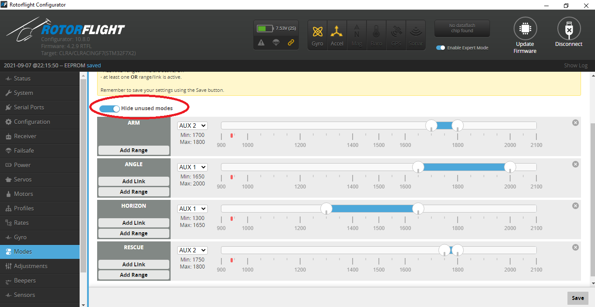
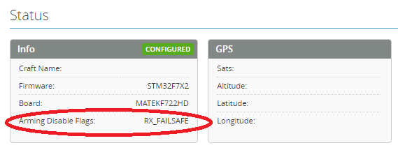
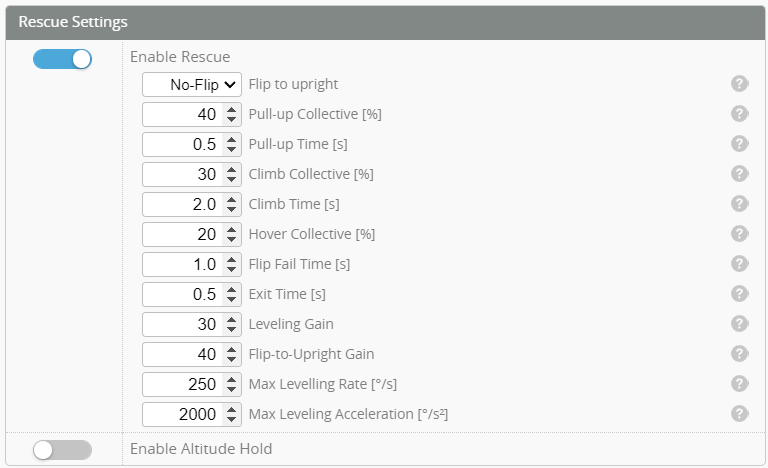
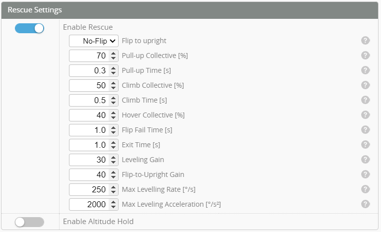

# Modes

The mode selector tab enables several modes and functions to be enabled or disabled via the TX. This is done by configuring a channel on the TX, such as a switch, that you wish to use for operating the mode. From the **Modes** tab, select the required Mode you wish to assign and click **Add Range**, then select the Aux channel matching your TX switch and set a range where you wish the mode to be active. If the mode you wish to use is not visible deselect "Hide unused modes".

- In the example below Aux1 is assigned to a 3 position switch on the TX. 
- Horizon mode has been assigned to the Aux1 Range when the middle position of Aux1 switch.
- Angle mode is assigned to Aux1 at full up position of the Aux1 switch.
- Nothing is assigned when Aux1 switch fully down. This means the Heli is in Normal or Acro mode. 

    

## ARM
All flight controllers need to be enabled before the motors are able to spool up. Once the Arming mode is configured (as shown above) the flight controller can be Armed ready for flight. If the flight controller detects an unsafe condition Arming will be disabled. If this occurs you can look at the Arming flag status on the **Status** Tab to identify what is preventing Arming being enabled.    

You can find out a description of these flags from the [List of Arming prevention flags](https://github.com/betaflight/betaflight/wiki/Arming-Sequence-%26-Safety#description-of-arming-prevention-flags)

This function can also provide the ability to prevent arming of the heli unless the correct model has been selected on your transmitter (if your RX does not have this functionality). This is done by adjusting the endpoint of your AUX channel to a different value for each model and setting the ARM range to enable the FC only for that model.      

## Rescue

Enable Rescue mode from the tabs. Allocate the Aux channel and range to suit.

:::info
The purpose of the rescue mode is to arrest any decent, then put the helicopter at a safe altitude in a stable attitude. It does this in stages.   
* Immediately levels in current orientation (upright or inverted)
* Applies a pull up collective to rapidly stop any decent  
* Applies a climb Collective to gain some height
* if it is still inverted (and the flip toggle enabled) it will flip to upright.
* Hover collective is now applied.
:::

After enabling Rescue mode configure the rescue settings from the **Profiles** Tab shown below:

#### Enable Rescue 
Enable or disable the rescue mode.  

#### Pull up collective
Values 0.0-100. This is to be set to a level where the helicopter rapidly gains height.  

#### Pull up time
How long pull up collective should be applied. This is usually about 0.3 to 0.5s

#### Climb collective
Values 0.0-100. This is to be set to a level where the helicopter gains height. 

#### Climb up time
How long Climb collective should be applied. This is usually about 0.5 to 1.5s

#### Hover collective
Set this to a value where the heli only slowly increases 

#### Flip Fail time
This is a safety feature. If there is a mechanical issue preventing the helicopter from completing the flip during this time the rescue mode will exit

#### Exit time
This slows the transition from rescue back to normal mode. This is helpful if you have rescued from inverted where your collective may be in the opposite direction. This prevents it from rapidly pitching down.

#### Leveling gain
How strong the helicopter will level. Too low and the helicopter will be sluggish to level. Too high and it will wobble/vibrate

#### Flip to upright gain
How strong the helicopter will flip to upright.

#### Max level rate
Used to control how fast the helicopter levels. Set this to a value that is achievable by your helicopter. Larger slower helicopters may need this reduced 

#### Max acceleration
Limit how fast the controller tries to accelerate the helicopter to level or flip. Larger slower helicopters may need this reduced 

## 6G flight modes
:::info
There are 3 types of self leveling stabilization modes available in Rototflight. 6G modes (unlike the normal Acro) will auto level when the transmitter sticks are released. These modes make the heli fly more like a drone.  
* Angle  
* Horizon  
* Acro Trainer  
::: 

 
* **Horizon** - Horizon mode provides attitude stabilization which will level the helicopter when the transmitter sticks are let go. Constant stick input is required to keep the helicopter moving.  

#### Horizon Mode leveling gain
Gain to define how aggressively the helicopter levels while in Horizon mode.

* **Angle** - Angle mode provides similar functionality to Horizon mode with the addition of limiting the helicopter attitude to the angle specified.  

#### Angle Mode leveling gain
Gain to define how aggressively the helicopter levels while at the Angle limit.

#### Angle Mode maximum angle
Limit the helicopter to a maximum of this angle while in Angle mode.

* **Acro Trainer** - Acro trainer mode does not provide self leveling of the helicopter. It does however limit the angle the helicopter can reach. 

#### Acro Trainer gain
Gain to define how aggressively the helicopter corrects while at the level limit.

#### Acro Trainer level limit
Limit the helicopter to a maximum of this angle while in Acro trainer mode.   

