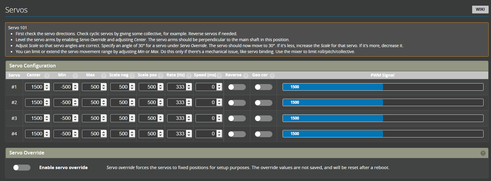

# Servos
Open the Servos tab and confirm that you have the correct number of servos. If this is not the case, please confirm you have installed the correct firmware (either 'M' motorized or servo tail) or if you are using a drone FC that your [Remapping](Remapping.md)  is correct.

### Servo Numbering
#### Direct  
Servo 1 - Pitch  
Servo 2 - Roll  
Servo 3 - Collective  
Servo 4 - Rudder  

#### CCPM  
For 120, 134 and 140 deg CCPM swashplates. 
Looking from the tail towards the nose of the helicopter:

Servo 1 - Pitch (inline with the centerline of the helicopter)    
Servo 2 - Left side  
Servo 3 - Right side  
Servo 4 - Rudder  

#### Fixed pitch  
90deg L  
Servo 1 - Pitch (inline with the centerline of the helicopter)    
Servo 2 - Side servo  
Servo 3 - Rudder  

*** Picture to go here ***

#### 90deg V   
Servo 1 - Left side    
Servo 2 - Right side  
Servo 3 - Rudder  

*** Picture to go here ***

### Servo Override
The toggle at the bottom of this page enables the servo overrides. The purpose of this is so that each servo can be driven by the slider to calibrate the range and center points. Beside each servo is an individual override.

The servo override slider scale is in degrees

## Servo Configuration parameters 

### Center
In general this will be 1500us for cyclic servos and 760us

### Min and Max
These are hard limits to prevent servos binding or moving outside of their mechanical limits. If a servo is commanded to a point that is greater or less than it is capable it will buzz and likely burn out. These settings should be used to limit the command.

### Scale Neg and Scale Pos
Scales the negative and positive direction of the servo to match the commanded angle.

### Rate 
This is the servo frequency. This will be specified by the manufacturer. A large proportion of servos suitable for cyclic operate at 333Hz.  

For Rotorflight 2 it is recommended that tail servos are assigned to a different timer than cyclic servos (see [Remapping](Remapping.md)). This means that tail servos can be set to a different frequency (i.e. faster)  

### Speed
Servo Speed Equalization. The aim of this parameter is to remove the collective "bobbing" when fast elevator changes are applied.

The bobbing happens because the elevator servo has to move double distance vs. the aileron servos, when elevator position is changed.
If the change is faster than the servos can go, the aileron servos will reach the target sooner than the elevator servo, causing the swash to jump slightly in the process.

To tune this value increase the speed value (it's actually ms/60deg, like in the datasheet) until the bobbing is not visible any more. It should be always ok to use the value from the datasheet if unsure.

### Reverse
Toggle for forward or reverse servo direction

### Geo Cor
Geometry Correction. Servos are rotary, so at high angles this results in smaller swashplate movement for each degree of servo movement. Geometry correction accounts for this and provides better control at high angles (e.g. 3D flight).

In order to use this feature it is important to set the servo arm at 90deg (with servo center) and calibrating the servo scale. 

## Servo Setup and Calibration
### Step 1
Confirm and set the servo [rate](#rate) as specified by your manufacturer. For many digital servos this is 333Hz.

### Step 2
* Set each of the override sliders to 0 degrees
* Set [center](#center) to your servo manufacturers recommendation. For Cyclic this will be 1500 or 1520us. 
* Fit servo arms to as close to 90 degrees as possible.

### Step 3
* Set Servo override to on
* Slide Servo 1 override in the positive direction (i.e. right)
* confirm the servo arm travels up towards the swashplate. If not toggle the [servo reverse](#reverse).

Repeat with remaining cyclic servos.

### Step 4
* Slide the servo override back to 0 degrees. 
* Slowly increase or decrease the [center](#center) until the servo arm is at 90 degrees

### Step 5
Calibrate the range. Not all servos move by the same angle for each change in command. This step calibrates this range so that the servo's move by the same amount. This means that the Geometric Correction can be used.
* Set the override to a positive value (e.g. 30deg)
* measure the current servo arm angle and increase or decrease the [Scale Pos](#scale-neg-and-scale-pos) until the servo arm angle matches the override angle.

