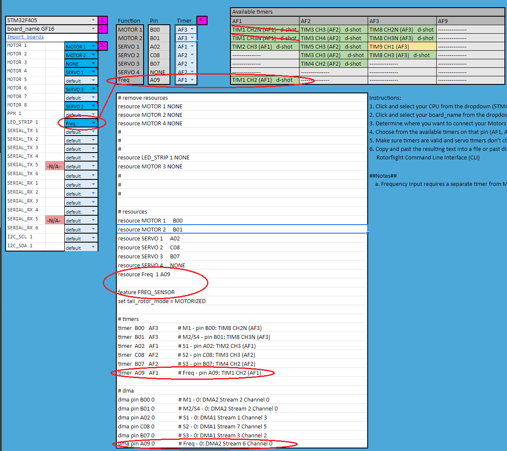
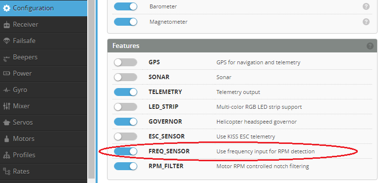

# RPM Measurement

In order to use the Governor or RPM filters (and why wouldn't you!!) you must measure the RPM. There are two options for this:
1. Frequency sensor
2. Bidirectional DSHOT

:::info
RPM can sometimes also be read via ESC telemetry. However, this is at a refresh frequency that is generally too slow to be used for filtering of governing.
:::

:::caution
RPM filtering is used to remove frequencies related to the rotating components. This allows a much higher tune; HOWEVER!! If the helicopter is flown in an OverSpeed condition the rotation of the one way bearing means that the RPM measurement will not be correct. If the helicopter is tuned too critically this could mean the helicopter could become out of tune resulting in unwanted oscillations.
:::

## Frequency Sensor

Typically it is used when the RPM is not available via ESC telemetry. Only BLHeli_32, some BLHeli_S and APD F3 ESCs support Dshot/KISS telemetry, so this feature is needed with a wide range of traditional ESCs.

The RPM signal is used in multiple places in the FC, e.g. in the PID control, the governor and the RPM-filter. If these features are not needed, then there is no need for the frequency sensor either.

An electrical frequency signal is provided by some ESCs, e.g. Hobbywing with the "yellow" wire. Or it can come from an RPM sensor, which is converting the motor three-phase voltages into a frequency signal - e.g. Hobbywing RPM sensor. Please refer to your ESC's or sensor's manuals how to connect them correctly.

Note about the Hobbywing RPM sensor: it's safest to power it with 3.3V, as the input voltage of the sensor is also the output voltage of the RPM signal it generates. All inputs on a STM32 MCU tolerate 3.3V, and some will also accept 5V. But if you're using a 8.4V BEC to power the sensor, you'll likely damage the MCU.

Up to two frequency sensors are supported, for acquiring motor #1 and motor #2 speed.

If both Frequency Sensor and telemetry RPM signals are available, the Frequency Sensor has precedence.

### Configuration

First, a pin must be configured for frequency sensor use. The pin _must_ be connected to a timer with exclusive access.
In other words, there must be a free timer, not used by anything else, and one of its positive channels must be available
on a pin that is connected to the FC's solder pads. Negative channels, like CH3N, can't be used as inputs. Once we know which timer and pin we can use, it can be configured for
frequency sensor use. This can be done via the [Custom defaults remapping spreadsheet](./Remapping) or by reading through the STM32 manual for your processor.

:::note
We recommend that Freq inputs are alocated to pins that have Timer 2 or Timer 5 available. If 2 Freq inputs are required (e.g. Motorized tail) then both inputs can share the same timer. In the remapping spreadsheet these pins are indicated by the green box marked Freq.
:::

In this example, we have chosen to use the LED_STRIP pin as our frequency input. We see there is only one option (Timer1) on AF1. We can use this pin but must not allocate any of the Servos or Motors to Timer1. Only the motor pins share this timer so we can choose either AF2 (timer3) or AF3 (timer8).



### The lines which configure the frequency signal
```
resource LED_STRIP 1 NONE
resource Freq  1 A09
timer A09 AF1 # Freq - pin A09: TIM1 CH2 (AF1)
dma pin A09 0 # Freq - 0: DMA2 Stream 6 Channel 0
```

Then the frequency sensor can be turned ON with the feature flag located on the ***Configuration*** tab.




## Bidirectional DSHOT

Several features of Rotorflight require telemetry data for the motor speed such as the Govenor and RPM Filtering. One method for the FC to get this motor speed is via Bidirectional DSHOT. Bidirectional DSHOT is an ESC protocol which enables communications in both directions between the FC and the ESC. The speed command can be sent by the FC to the ESC and the ESC responds by sending the current motor eRPM (electrical RPM).

From the **Motors** tab in Rotorflight Configurator select an DSHOT ESC protocol (DSHOT150-DSHOT600) and enable Bidirectional DSHOT. This requires ESC firmware that supports Bidirectional DSHOT.

### Supported ESC Firmware
#### BLHeli_32
Bidirectional DSHOT is fully supported from firmware version 32.7.0 onward. ESCs with earlier firmware will have to be updated before speed telemetry will operate.

#### BLHeli_S
BLHeli_S ESCs do not support Bidirectional DSHOT. In order to access this functionality with a BLheli_S ESC, alternative firmware must be flashed. There are currently 3 options for this.

##### 1. Bluejay
Bluejay is an open source firmware for BLheli_S ESCs which supports Bidirectional DSHOT, see [BlueJay](https://github.com/mathiasvr/bluejay). This firmware has been used successfully for several Rotorflight builds. Bluejay is capable of flashing individual settings to each ESC (tail and main) which is important when using an all in one (AIO) board. Bluejay v0.15 and later also supports disabling *damped light* (regenerative breaking), a must if your helicopter doesn't have a one way bearing. For example, a K110 will yaw/spin rapidly on throttle hold if *damped light* is enabled. See [Flashing Bluejay](Blheli_S-to-Bluejay) for details.

##### 2. BLheli_M
BLheli_M is developed by JazzMaverick. It supports Bidirectional DSHOT, but you can't disable *damped light* mode and it does not have the ability to download individual config to each ESC. [JazzMaverick on GitHub](https://github.com/JazzMaverick/BLHeli/tree/JazzMaverick-patch-1/BLHeli_S%20SiLabs)

##### 3. JESC
Jesc is a paid firmware version for BLheli_S ESCs which supports Bidirectional DSHOT. [JESC](https://jflight.net/index.php).

## More information
More details on Bidirectional DSHOT and RPM filtering at [betaflight](https://github.com/betaflight/betaflight/wiki/Bidirectional-DSHOT-and-RPM-Filter).
