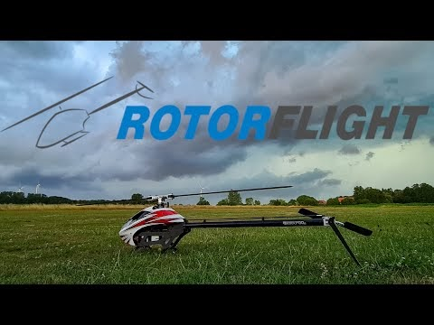

# Introduction  
Rotorflight is a flight control software suite for single rotor RC helicopters. It is based on Betaflight, with many advanced features added for helicopters. It consists of several components:
Rotorflight Firmware: the software that runs on your flight controller.
The Rotorflight Configurator: update and configure the firmware using Windows, macOS or Linux.
Optional: Rotorflight Blackbox Explorer: analyse Rotorflight logs on your computer.
Optional: Rotorflight LUA scripts: tweak your helicopter on the field using your OpenTX/EdgeTX transmitter.
Most Betaflight F4, F7 and H7 flight controllers are compatible with Rotorflight. They usually require some soldering. Since 2023 there are also commercial Rotorflight controllers available, such as the Flywing HELI-F405 or the Steam FlyDragon F722. Those dedicated Rotorflight controllers resemble traditional FBL units and don't require any soldering.
Rotorflight does NOT support multi-rotor drones, nor airplanes; it is only for traditional RC helicopters.

:::note
This website is specifically for Documenting and testing the Rotorflight 2 development code. If you are new to Rotorflight and wish to get started we recommend that you use the stable version of Rotorflight 1.0.2. This can be downloaded from the Github project page. The documentation for this version is in the Github Wiki. 
:::

## Latest Rotorflight 2 Version  
The Rotorflight 2 Snapshots for testing can be found on the **Announcements** page. Please join the Rotorflight Discord discussion to ask questions and get assistance from the links at the bottom of this page.

