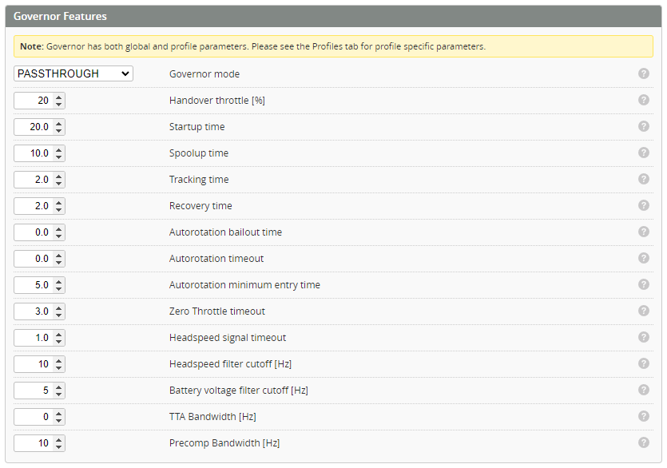
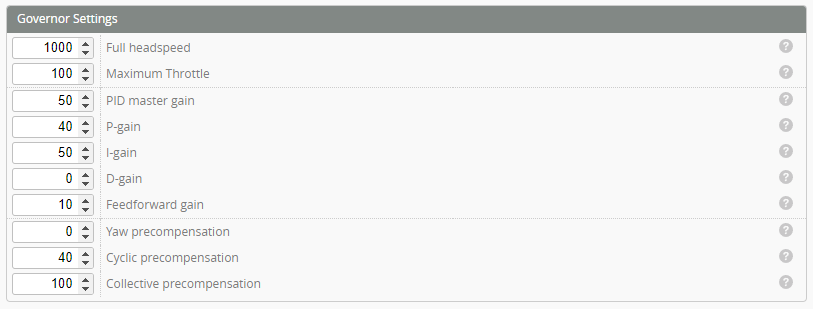

# Governor
:::info
The purpose of the governor is to maintain a constant headspeed regardless of flight inputs, flying conditions, battery voltage, external disturbances, etc. In Rotorflight, the governor also provides other motor related features, like slow spoolup, autorotation control, battery voltage drop compensation, and fault detection and recovery.
:::

# Governor Features
The governor can be turned ON/OFF with the dorp down menu within **Governor Features** from the **Motors** Tab.

If the feature is disabled, all governor functions are disabled, and the throttle output is taken directly from the receiver throttle channel.

## Governor Mode

The governor has multiple operating modes, each using a slightly different method for the throttle control in the PID loop. Select a mode from one of the values below.

### OFF

The governor is disabled, and the stabilized throttle output ST is taken from the receiver throttle channel.

### PASSTHROUGH

The governor does not control the headspeed, but provides all the aux functions, like slow spool up, autorotation bailout, and error recovery. In the active state, the receiver throttle channel is directly passed through to the stabilized throttle output ST.

### STANDARD

The governor is stabilizing the headspeed with a standard PID control, similar to most ESCs. All aux functions are also active.

### MODE1

Like STANDARD, but with collective/cyclic precompensation. This is similar to governors in most FBL systems.

### MODE2

Like MODE1, but with battery voltage compensation. The PID loop does not need to react to battery voltage fluctuations, as it is taken into account outside the PID loop. This is usually the best choice. Can be used only if the battery voltage is connected to the FC.

## Governor Basic Settings

In order to use the governor you must first configure the ESC/Motor features. This defines the motor telemetry (for RPM feedback) and gear ratios for your helicopter which lets the flight controller know how fast the rotor is spinning.

### Handover throttle

The throttle level above which the governor is activated. Below this level the input throttle is passed to the ESC, above this level the governor is enabled and the input throttle is used for calculating the target headspeed. The motor must be able to start below this throttle level.

### Startup time

startup time is applied before the RPM is detected.
Some ESCs require really slow startup ramp to be gentle.
Some other ESCs need really rapid start for starting at all.

### Spoolup time

This is an acceleration limit (in seconds) used for spooling up (After a valid rpm signal has been detected). It sets the acceleration limit that is equivalent to total time for spooling up from zero to full headspeed. For example, with a value of 10 and full headspeed of 3000rpm, the main rotor would take 10s to reach 3000rpm.

### Tracking time

Acceleration limit (in seconds) for normal operation. This occurs when the requested headspeed command changes while the governor is in the active state. This parameter limits the rpm change speed (acceleration). For example, when set to a value of 10 (which is 10s to ramp 0-100%). If hovering in Normal mode at 1500rpm (50% throttle) and then switching to Idl3 of 3000rpm (100% throttle) the Governor would ramp over 5s. Typical value is 5..20.

### Recovery time

Acceleration limit (in seconds) for error recovery. When the governor is recovering from lost headspeed or lost throttle signal, this is the max acceleration for the following (faster) spoolup.

### Autorotation bailout time

Acceleration limit (in seconds) for autorotation bailout. When the governor is spooling up from autorotation, it is limiting the spoolup speed with this parameter.

### Autorotation timeout

In the autorotation state, if high throttle returns before this timeout expires, the spoolup is done with bailout acceleration. After the expiration, the governor enters the idle state, and any subsequent spoolup is slow.

### Autorotation minimum entry time

Minimum flight time before Autorotation can be engaged.

### Zero Throttle Timeout

When the throttle input (from receiver) goes to zero, the governor enters an intermediate state where it is waiting for the throttle to return. If the throttle returns before this timeout expires, the spoolup is done with the recovery acceleration. If the timeout expires, the governor enters off state, and any future spoolup will be slow.

:::note
The purpose of this feature is to allow fast spoolup in case the throttle cut (hold) is hit accidentally. 
If high throttle is returned very soon after, the heli will spool up quickly and hopefully keep on flying. Unit is 0.1s. 
Typical value is 5..50.
:::

### Headspeed Signal Timeout

If the headspeed rpm signal is lost, the governor enters an intermediate state where it is waiting for the rpm signal to return. If the signal returns before this timeout expires, the spoolup is done with the recovery acceleration. If the timeout expires, the governor enters the idle state, and any future spoolup would happen with the default (slow) spoolup acceleration. Unit is 0.1s. Typical value is 5..50.

### Headspeed Filter Cutoff [Hz]

The inputs to the governor must be clean from excess noise. The RPM input is filtered with a BIQUAD filter, with the frequency cutoffs set by these variables.

### Battery Voltage Filter Cutoff [Hz]

The inputs to the governor must be clean from excess noise. The Battery voltage input is filtered with a BIQUAD filter, with the frequency cutoffs set by these variables.

### TTA Bandwidth [Hz]

Cutoff for the TTA (Torque Tail Assist) lowpass filter.

### Precomp Bandwidth [Hz]

Cutoff for the cyclic/collective precompensation lowpass filter.

## Governor Profiles Settings

These settings are set from the Profiles Tab. If desired, individual Profiles can be configured via the Adjustments Tab. This enables individual flight modes to have separate tuning and configuration set for each flight mode. (similar to 'Bank Switching').

### Full Headspeed

This is the highest headspeed that the governor would ever try to maintain, when the throttle input is at 100%.

### Maximum Throttle

Maximum output throttle the governor is allowed to use.

### PID Master Gain

Master gain multiplier

### P-Gain

Governor Proportional gain

### I-Gain

Governor Integral gain

### D-Gain

Governor Derivative gain

### Feedforward-Gain

Governor Feedforward gain

### Yaw precompensation

Yaw precompensation weight. Determines how much yaw is mixed into the feed forward. This helps the governor to maintain the headspeed proactively. Usually 20..100

### Cyclic precompensation

Cyclic precompensation weight. Increasing the cyclic increases load on the rotor and causes it to slow down. This setting determines how much cyclic is mixed into the governor feedforward. This helps the governor maintain the headspeed proactively (i.e. increase power to the motor so it does not slow down). Usually 20..100

### Collective precompensation

Collective precompensation weight. Increasing the collective increases load on the rotor and causes it to slow down. This setting determines how much collective is mixed into the governor feedfoward. This helps the governor maintain the headspeed proactively (i.e. increase power to the motor so it does not slow down). Usually 20..100

## Governor throttle input ranges

With the governor feature activated, the transmitter throttle channel is controlling the governor, rather than the ESC directly.

Depending in which range the throttle value falls into, the governor will function differently.

### THROTTLE < 0%

This throttle value indicates throttle hold (throttle cut) condition. It's guaranteed that all motors are stopped immediately. The throttle output from the governor is guaranteed to be zero.

:::note
Make sure your transmitter is sending a value lower than 0% when throttle hold is activated.

Throttle hold SHOULD NOT be used for autorotation.
:::

### 0% < THROTTLE < 10%

In this range, the governor is in idle or autorotation state, and the output is zero - the main motor is stopped.

:::note
Motorized tail is fully active in this range.

If you want to perform autorotation with the main motor stopped, use this range!
:::

### 10% < THROTTLE < 20%

In this range, the governor is in idle or autorotation state, and the output is in 0% - 10%, increasing linearly through the range.

:::note
Motorized tail is fully active in this range.

If you want to perform autorotation with the main motor running, use this range!
:::

### 20% < THROTTLE < 100%

In this range, the governor is in active state, and the requested rpm is 20%..100% of the gov_headspeed.

## Governor State

The governor internal state can be observed in the blackbox log. It is a good indication on what the governor is trying to do.

`OFF` The governor is disabled and the throttle output is zero.

`IDLE` The governor is idle, because the input throttle is in the idle range. The throttle output is as described above - 0..10%.

`SPOOLING_UP` The input throttle has transitioned from low to high, and the governor is spooling up slowly.

`ACTIVE` The governor has reached the target headspeed and is actively maintaining it.

`LOST_THROTTLE` The throttle signal has suddenly dropped from high to low. If the throttle returns quickly, a recovery spoolup is performed. This state is for convenience, when the pilot accidentally hits throttle hold, and then realizes the mistake.

`LOST_HEADSPEED` The RPM input signal is lost. The governor will wait for a little while for the signal to return, before spooling down. It the signal returns quickly, a recovery spoolup is performed.

`RECOVERY` The governor is performing a recovery spoolup after one of the conditions above.

`AUTOROTATION` The throttle has dropped from high to the autorotation range. The governor is expecting the throttle to return once the autorotation has been performed. Once the throttle return, the governor moves to the state below.

`AUTOROTATION_BAILOUT` Throttle has returned while in AutoRotation state, and the governor is performing an autorotation bailout.