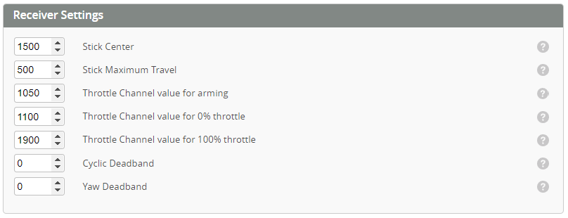
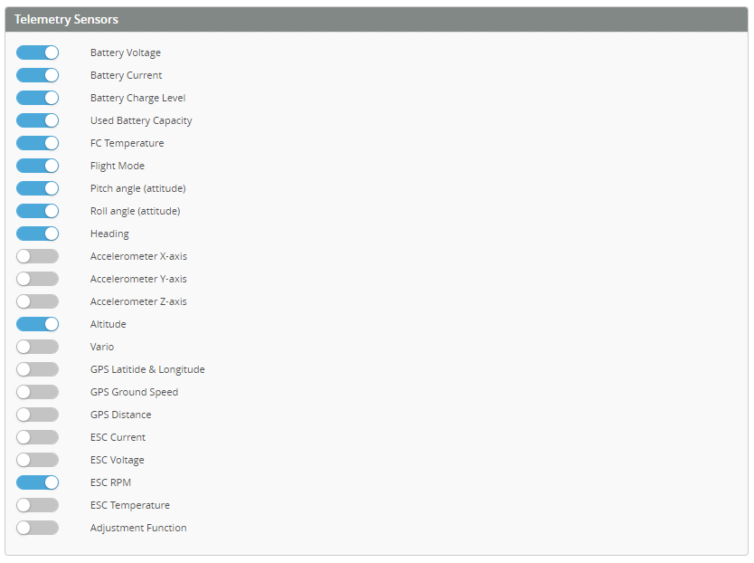

One of the first things you should do is to connect a receiver to the FC. Your FC has several UARTs, and each UART has a TX and an RX. A receiver needs to be connected to an RX and/or TX pad, depending on the type of receiver.

## Receiver Configuration

First activate `Serial Rx` on the UART you have connected your receiver.

## Receiver Type

There are many receiver protocols supported in Rotorflight, SBUS in the one of the most known receiver protocols, however it is not telemetry capable. On the Other hand FrSky F.Port and ELRS are the most used protocols because they support _telemetry_ and thus allow you to use the [Rotorflight LUA app](./LUA-Scripts.md) to perform tuning using you radio.

* SBUS needs to be connected to an RX pad.

* [SBUS with S.Port](https://oscarliang.com/sbus-smartport-telemetry-naze32/): the SBUS pin needs to be connected to a free UART RX, and the S.Port pin needs to be connected to a free UART TX (of *another free UART*), and you activate `Telemetry: FrSky SmartPort` on that UART.

* F.Port needs be connected to a TX pad, with `Inverted Serial Signaling` activated ,and `Half-Duplex` activated.

:::note
The `Inverted Serial Signaling` option will work only on **F7/H7** or **G4** type mcu, if you are using an **F4** mcu, then you need to use and external signal inverter, or hack your receiver to get an Un-Inverted signal for SBUS, S.Port, and F.Port.
for more info check [Uninverted SBUS and Smart Port on Frsky Receivers](https://oscarliang.com/uninverted-sbus-smart-port-frsky-receivers/)
:::

* [CRSF/ELRS](https://www.expresslrs.org/2.0/quick-start/receivers/wiring-up/) needs an RX and a TX on the same UART. 

Please see the documentation for your FC for more details on how to connect your receiver. 

## Receiver Channels

Select the corresponding channels order based on the selected receiver type.

* For FrSky receivers, set the channels in your radio as per the below order.

* For ELRS receivers, set the channels in your radio as per the below order.

:::note
For **CRSF/ELRS** always set *ARM* switch to *CH5/AUX1* on the radio, also set *THR* to *CH6*
:::

* Revert channels on your transmitter if a channels responds the wrong way around. 

## Receiver Settings

* **Stick Center** - adjust as required by your radio to achieve 0% when the _ROLL, PITCH, YAW_ sticks are centered. 
* **Stick Maximum Travel** - adjust achieve 100% at the sticks limits.
* **Throttle Channel value for arming** - channel value under which arming is allowed.
* **Throttle Channel value for 0% throttle** - adjust to achieve 0% on the channel bar.
* **Throttle Channel value for 100% throttle** - adjust to achieve 100% on the channel bar.
    * NOTE! Throttle hold must send a value than is lower than 0% level, for example you can set you radio to send 1000us at 0% throttle, and 975us at throttle hold.
* **Cyclic Deadband** and **Yaw Deadband** - adjust to the smallest possible value that doesn't make your model drift in the *Rates Preview* window.

:::caution
Calibrating Stability Mode
The stability modes (Angle, Horizon or Rescue) can be calibrated so that the heli doesn't drift much when using such a mode. This can only be done via the [accelerometer trims](https://github.com/rotorflight/rotorflight/wiki/Using-stability-modes/_edit#calibrating-stability-modes). 
**Do not use trim on your transmitter**.
:::

You should end up with something similar to this:  

## Telemetry Sensors

Use the below switches to enable/disable the telemetry sensors from the telemetry stream sent to your radio.

### ELRS Telemetry (reuse)
**Why don't I have RPM telemetry to my radio??**  
The Crossfire Protocol (CRSF) used by ELRS does not include the full range of sensors that can be useful for rotorflight. Crossfire was specifically designed for Drones, which generally have different parameters that are useful to the pilot.

As a temporary fix for this issue a series of telemetry items that are currently transferred to the transmitter can be ***re-used*** to transfer information we would rather see. There are four messages that can be chosen, each with a variety of telemetry sensor options.

1. Flight mode 
    `set crsf_flight_mode_reuse = [OPTION]`  
    [Option] Allowed values: NONE, GOVERNOR, HEADSPEED, THROTTLE, ESC_TEMP, MCU_TEMP, MCU_LOAD, SYS_LOAD, RT_LOAD, BEC_VOLTAGE, BUS_VOLTAGE, MCU_VOLTAGE, ADJFUNC, GOV_ADJFUNC
2. Pitch attitude 
    `set crsf_att_pitch_reuse = [OPTION]`  
    [Option] Allowed values: NONE, HEADSPEED, THROTTLE, ESC_TEMP, MCU_TEMP, MCU_LOAD, SYS_LOAD, RT_LOAD, BEC_VOLTAGE, BUS_VOLTAGE, MCU_VOLTAGE
3. Roll attitude
    `set crsf_att_roll_reuse = [OPTION]`   
    [Option] Allowed values: NONE, HEADSPEED, THROTTLE, ESC_TEMP, MCU_TEMP, MCU_LOAD, SYS_LOAD, RT_LOAD, BEC_VOLTAGE, BUS_VOLTAGE, MCU_VOLTAGE 
4. Yaw position
    `set crsf_att_yaw_reuse = [OPTION]`  
    [Option] Allowed values: NONE, HEADSPEED, THROTTLE, ESC_TEMP, MCU_TEMP, MCU_LOAD, SYS_LOAD, RT_LOAD, BEC_VOLTAGE, BUS_VOLTAGE, MCU_VOLTAGE
5. GPS Heading
    `set crsf_gps_heading_reuse = [OPTION]`  
    [Option] Allowed values: NONE, HEADSPEED, THROTTLE, ESC_TEMP, MCU_TEMP, MCU_LOAD, SYS_LOAD, RT_LOAD
6. GPS Ground Speed
    `set crsf_gps_ground_speed_reuse = [OPTION]`  
    [Option] Allowed values: NONE, HEADSPEED, THROTTLE, ESC_TEMP, MCU_TEMP, MCU_LOAD, SYS_LOAD, RT_LOAD
7. GPS Altitude
    `set crsf_gps_altitude_reuse = [OPTION]`  
    [Option] Allowed values: NONE, HEADSPEED, THROTTLE, ESC_TEMP, MCU_TEMP, MCU_LOAD, SYS_LOAD, RT_LOAD
8. GPS Sats
    `set crsf_gps_sats_reuse = [OPTION]`  
    [Option] Allowed values: NONE, ESC_TEMP, MCU_TEMP, PROFILE, RATE_PROFILE, LED_PROFILE

To use this feature:
* Enable Telemetry. If you have not done so already enable the telemetry toggle on the receiver tab.

* Enable each of the telemetry messages that you wish to 'reuse'.

* In the CLI enter the command and option you wish to use. Enter and save,

* The transmitter will now show the headspeed in the **FM** telemetry. To add the units click on the sensor and "Edit".

  

:::hint
Follow the [ELRS Telemetry Reuse WalkTrough](../Tutorial-Walkthroughs/ELRS-telemetry-reuse.md) for a practical example on ELRS sensors Reuse and Setup.
:::

