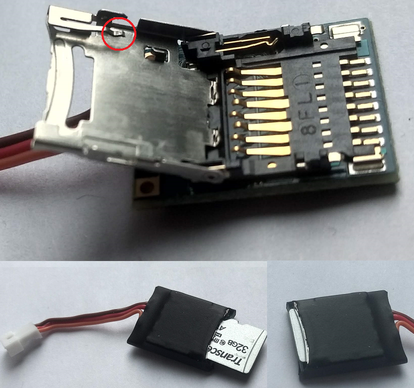

# OpenLog and OpenLager

## Connecting OpenLog or OpenLager

OpenLog and OpenLager can be connected to the FC using just three wires: +5V, ground and a TX output pad from a free UART on the FC, which is connected to the RX pad of the logging device. As soon as you power the device on, it will create a new log file on the SD card. Then it'll log everything it receives to that file. Simple but effective.

:::note
For maximum performance the SD card should be formatted with the [SD Association's special formatting tool](https://www.sdcard.org/downloads/formatter). A fast SD card is needed, e.g. the Sandisk Extreme 16GB Class 10 UHS microSDHC.
:::

## OpenLog

OpenLog is a [data logger developed by SparkFun](https://www.sparkfun.com/products/13712). It can record up to 250kbps, but since it doesn't have a write buffer data can be lost. For better results the original SparkFun firmware should be replaced with [Blackbox firmware](https://github.com/cleanflight/blackbox-firmware). You need an FTDI cable/adapter to update the OpenLog board. There are also OpenLog clones for sale that are already equipped with Blackbox firmware. You can check your firmware by inspecting the Config.txt file on the SD card, a file that will be created if it doesn't already exist. If it just states the baud rate (e.g. a line with a number and then a line with the word baud), it's using the Blackbox firmware. The SparkFun firmware specifies more properties in Config.txt: baud, escape, esc#, mode, verb, echo, ignoreRX.

## OpenLager

OpenLager is a [Blackbox data logger developed by dRonin](https://github.com/d-ronin/openlager/wiki). It can log a lot faster than OpenLog (up to 2470kbps) and uses a write buffer. It's superior to OpenLog, and unless you're on a very tight budget there's no excuse not to use OpenLager.

Some versions use an open/lock hinge mechanism instead of a 'push to eject' SD card socket, so you can't wrap it in heat shrink tube. You can fix that by carefully flattening the SD card retainer pin a little bit.

## Configure Blackbox Logging

After you've connected OpenLog/OpenLager, you have to tell Rotorflight to which UART the TX pad for the logger is connected to. You can specify that UART in the _Configuration_ tab, under _Blackbox logging_. For OpenLog, select a baud-rate of 250000 bps, for OpenLager select 2000000 bps. Click _Save_ and _Reboot_.

After configuring OpenLog/OpenLager you can go to the *Blackbox* tab to specify what should be logged when.