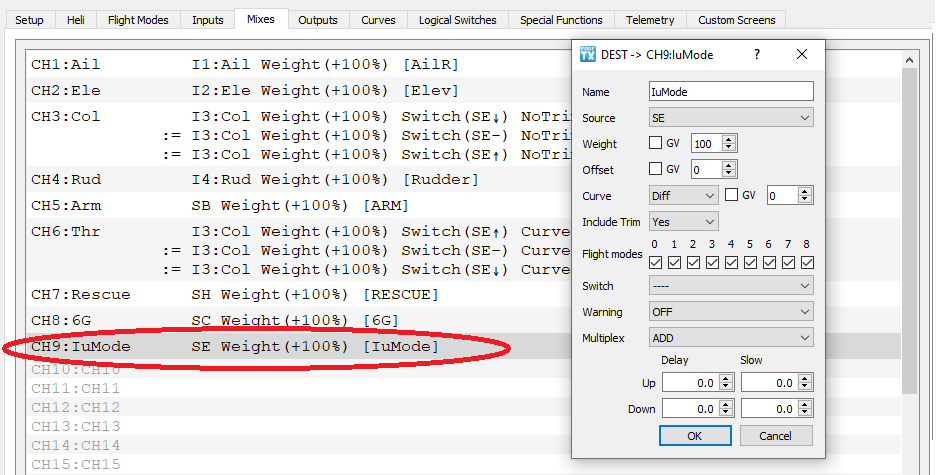
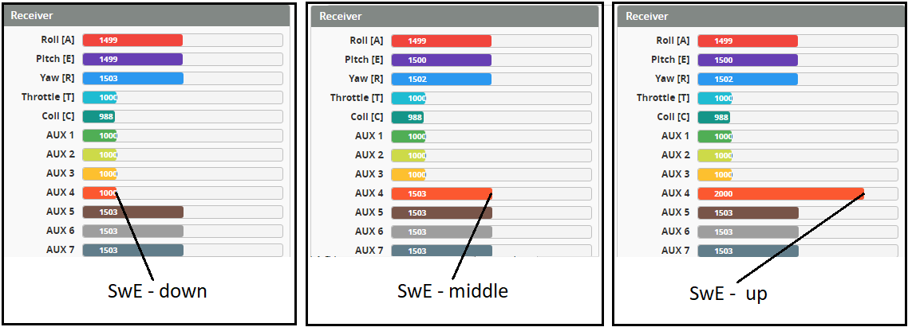

# Profile (Bank) switching example

## Purpose

:::info
  We often configure several flight modes to suit our own flying requirements e.g. (Futaba - Normal, IU1, IU2)(OpenTx - FM1, FM2, FM3). It is quite possible that with each of these flight modes we would want to adjust and tune the model independently. We can do this through the Adjustments tab. This is a similar feature to V-bar 'Bank switching'. The following example is just a suggestion and is one way to go about using the adjustments tab. The same process can be used to switch rates if required.  
:::

## Aim
My helicopter has already been set up to have a 3 position switch (SwE) which selects between 3 headspeeds (I use the governor so my 'curves' are just flat). The following example will add switching of tuning parameters (**Profile** Tab) for each of these headspeeds. 

### Configure the Tx
We need to assign a spare channel to your 3 position switch (SwE) (can be any channel or switch). 

**NOTE** This example shows the process for EdgeTx (same for OpenTX) but is really the same process for any transmitter.

**Step 1:** Assign Ch9 to the SwE in the **Mixers** tab

### Configure flight controller

**Step 2:** looking at the channels in the **receiver** tab we can see that Aux4 is the ninth channel. This matches our TX assignment from step 1.  Confirm the 3 position switch changes the value seen on Aux4,  

**Step 3:**  
:::note
The **Adjustments** tab is not implemented yet in RF2. However you can still perform profile switching using [CLI Profile Switching Method](../Tutorial-Walkthroughs/Profile-switching-example.md) on the following page.
:::

<!--   
**Step 3:** 
- Go to the **Adjustments** tab. Enable an adjustment slot and select Aux4 as the control channel. 
- Stretch the range slider across the entire channel range. This covers the positions for each of the three switch positions.  
- Select **Profile Selection** from the dropdown. This means we want to change the 'Profile selection' by the switch position.
- Set the apply channel to Aux4. 
- Set Min = 1 and Max = 3. This means over the defined range a value of 1-3 will be chosen based on the switch position. (e.g. SwE down = 0, SwE middle = 1, SwE up = 2). These values are added to the Profile so will result in (e.g. SwE down = Profile 1, SwE middle = Profile 2, SwE up = Profile 3).     

**Step 4:** Go to the **Profiles** tab and test and confirm that changing the switch position results in changing of the current Profile.

-->

